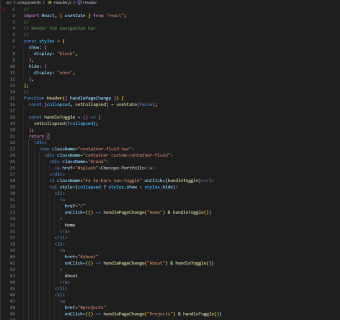

# Unit 20 React: React Portfolio

This is a **React** application for my **Professional Portfolio**. The application uses **components** to render all the sections (_Header_, _Navigation_, _About_, _Projects_, _Contact_, and _Resume_) in a single page, and **Hooks**, like **useState**, to control the application state and flow.

## Implementation

- [Features](#features)
- [Installation](#installation)
- [Usage](#usage)
- [License](#license)
- [Credits](#credits)

## Features

The application features the use of **Components** to enable reusing and plugging in logic as needed, **Props** to pass data between components, and **Hooks** to control the application state and flow (for instance, **useState** is used to conditionally render components based on the application state, and to style the application conditionally). The application has been optimized for mobile devices using **Boostrap** library and **Custom CSS**.





## Installation

The application requires [Node.Js](https://nodejs.org/en/) Runtime Library and [React](https://reactjs.org/) library. It also requires installing **Boostrap** and importing **Font Awesome** for styling.

A JSON file containing these dependencies is included with this project. To set up the development environment for the application, simply run the following command:

```bash
npm install
```

Once the required packages are installed, run the following command to start the application:

```bash
npm run start
```

If you want to create a brand new application, run the following command as documented in the **React** website:

```bash
npx create-react-app my-app
cd my-app
npm start
```

## Usage

The application has been coded with a _mobile first_ approach in mind. It allows users to navigate a sample of my professional portfolio and check out the **Live** application and the application **repository** in **GitHub**, while providing links to my **LinkedIn**, **GitHub**, and **Twitter** Profiles, were users can check further projects that I am working on. IT also provides my updated **Resume** and will soon host a fully functional **Contact** form for users to contact me directly from the website. (_Note_: the Contact form feature is still not functional as it is currently under development.)

Check out the live application in [GitHub Pages](https://japinell.github.io/ku-cbc-homework-20-react-portfolio/).

## Credits

I would like to recognize the work of other developers and designers at [Codepen.io](https://codepen.io/), whose webpage templates inspired me in building the layout for my application. The Codepen website has a host of amazing work from smart developers and designers. I intend to _root for_ those guys and girls, and more importantly, share my work as I progress in my journey of establishing myself as a **Full Stack Web and Mobile Developer**. I recommend you visiting the website for inspiring work and for finding the human resources you need for your projects.

## License

This project is licensed under The MIT License. Refer to https://opensource.org/licenses/MIT for more information of what you can and cannot do with this project. See contact information below if you have questions, comments, or suggestions for the project.

## Contributing Guidelines

Want to contribute to this project? You may clone or fork the project in GitHub. Note the licesing information referred in this file.

## Contact Information

For questions, comments, or suggestions, please contact me by E-Mail:

japinell@yahoo.com

Check out my other **cool** projects in GitHub - https://github.com/japinell

## License

This application is licensed under the following license:

[](https://opensource.org/licenses/MIT)(https://opensource.org/licenses/MIT)
